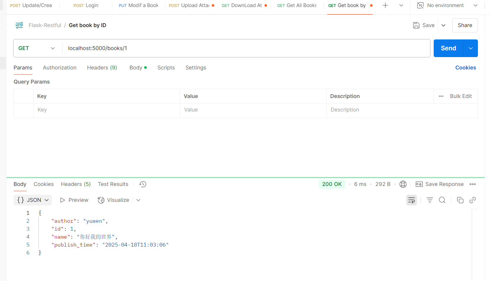
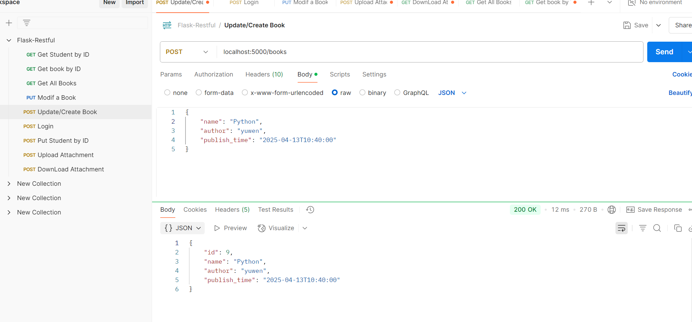
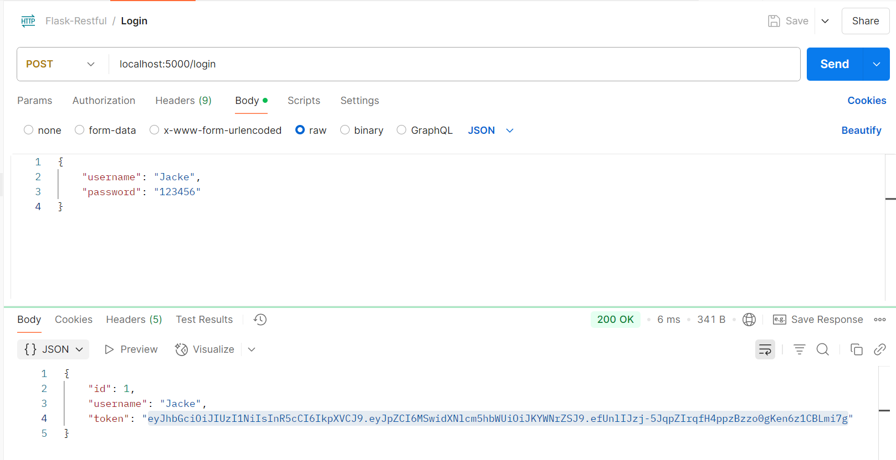
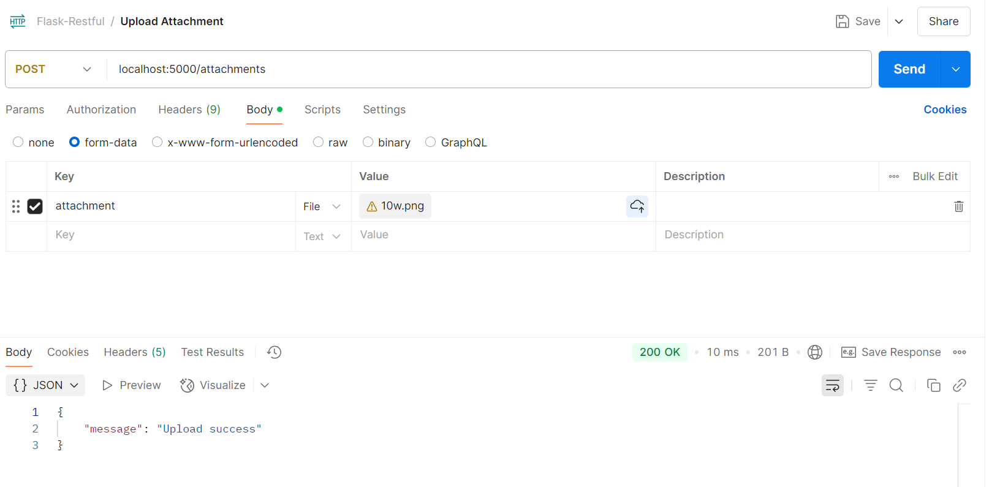
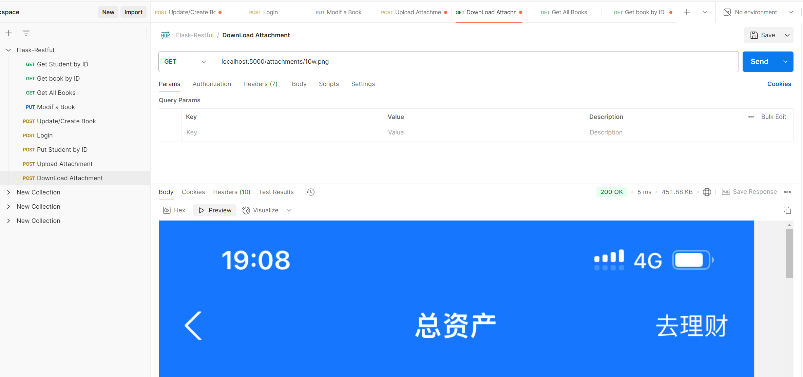
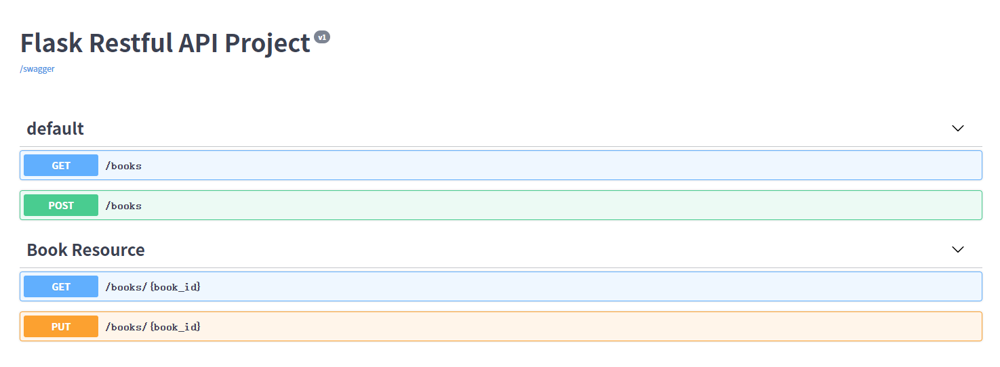
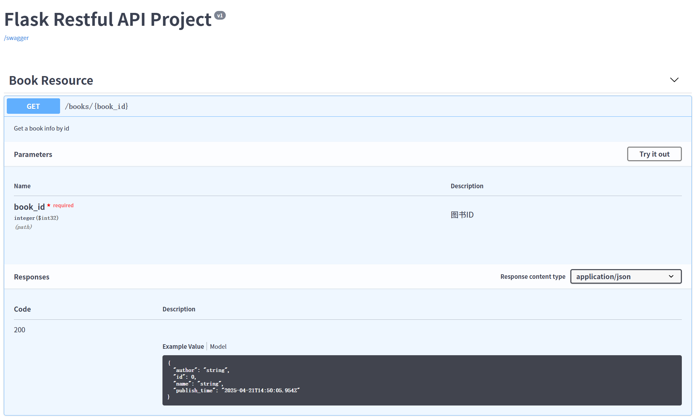
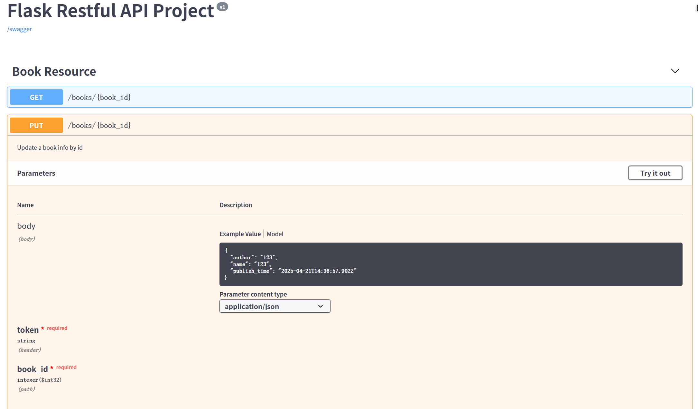
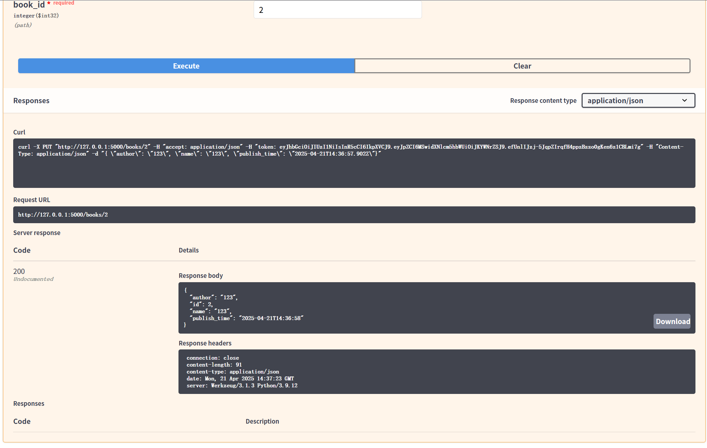

# FlaskRestfulAPI

#### 介绍
记录学习 Flask Restful API 开发的过程

> 项目来源：[【Flask Restful API教程-01.Restful API介绍】]( https://www.bilibili.com/video/BV1mc411m7Ke/?share_source=copy_web&vd_source=d0886da49a29063777f2956d5780b087)
>
> 我的代码仓库：https://gitee.com/giteechaozhi/flask-restful-api.git
>
> 后端API接口实现功能：数据库访问控制，后端登录鉴权，上传和下载文件，对存量API规范性访问开发

## 1、访问数据库

## 2、增加与修改数据API

## 3、API的身份认证

## 4、文件上传与下载的API

## 5、生成swagger文档
- **使用flask-restx生成swagger文档**

- **Json**
  

  

- **Yaml格式**
  

## 6、swagger中的请求与响应

