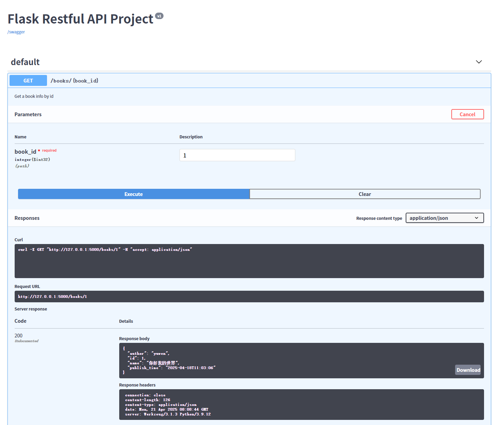
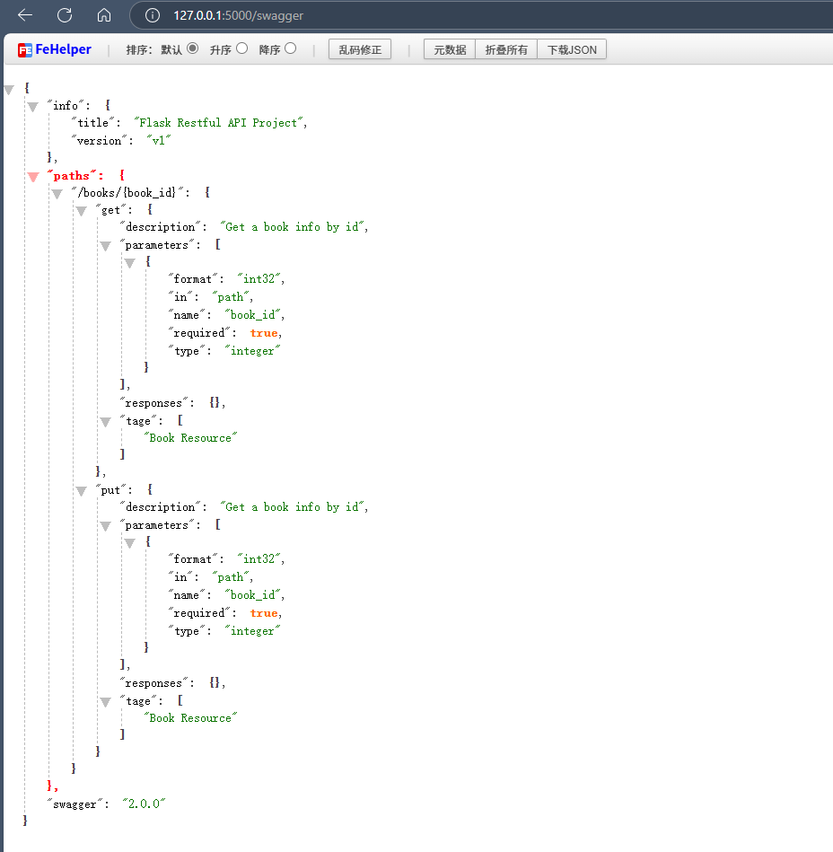
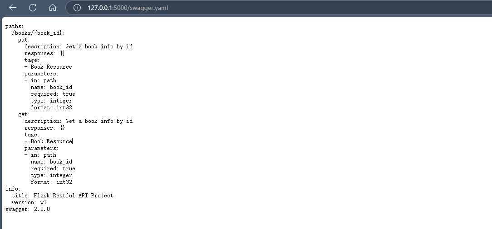

# FlaskRestfulAPI

#### 介绍
记录学习 Flask Restful API 开发的过程

> 视频教程：【Flask Restful API教程-01.Restful API介绍】 https://www.bilibili.com/video/BV1mc411m7Ke/?share_source=copy_web&vd_source=d0886da49a29063777f2956d5780b087
> 
> 仓库地址： 
#### 软件架构

软件架构说明

## 1、Restful API介绍

## 2、使用Flask Restful开发API

## 3、访问数据库

## 4、增加与修改数据API

## 5、API的身份认证

## 6、文件上传与下载的API

## 7、生成swagger文档
- **使用flask-restx生成swagger文档**

- **Json**
  

  

- **Yaml格式**
  

## 8、swagger中的请求与响应
